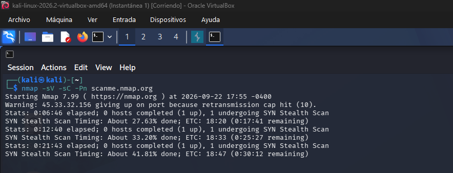
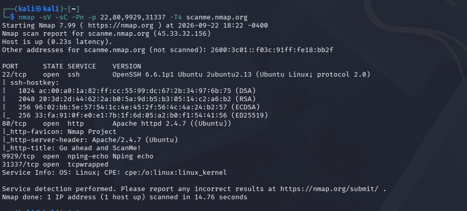

# Objetivo 2: Escaneo de red (Nmap)

## Objetivo analizado
- **Objetivo:** scanme.nmap.org (servidor oficial de pruebas de Nmap)

## Secuencia
Primero ejecute el siguiente codigo 

```bash
nmap -sV -sC -Pn scanme.nmap.org
```
Este comando derivo en el siguiente cuadro



Como el tiempo de escaneo era demasiado largo, empece a investigar una forma distinta de hacerlo y con
ayuda de nuestro amigo google y su agente Gemini utilice el siguiente codigo 

```bash
nmap -sV -sC -Pn -p 22,80,9929,31337 -T4 scanme.nmap.org
```
Este comando optimiza el tiempo de escaneo dirigiendose a puertos especificos con una planilla
de temporizado rapído, detectando ademas versiones y scripts por defecto de cada servicio.
Y nos dejo con este resultado



## Resultado del Escaneo
 **Puerto 22/tcp (SSH):** Abierto. Servicio OpenSSH 6.6.1p1 Ubuntu 2ubuntu2.13 (protocolo 2.0).
 
 **Puerto 80/tcp (HTTP):** Abierto. Servidor web Apache httpd 2.4.7 (Ubuntu).
 
 **Puerto 9929/tcp (nping-echo):** Abierto. Servicio Nping echo.
 
 **Puerto 31337/tcp (tcpwrapped):** Abierto. Servicio Elite / tcpwrapped.
