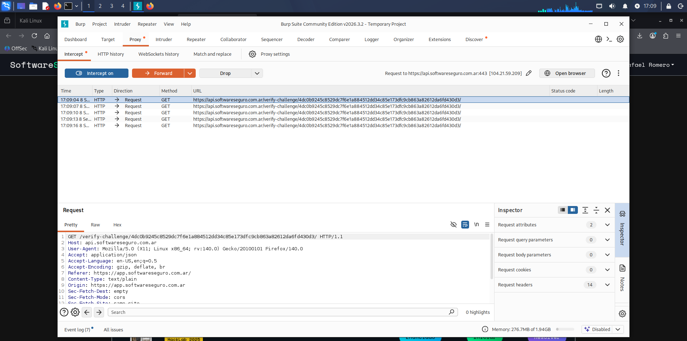

# Objetivo 4: Instalación de proxy
Aca esta la captura de pantalla que demuestra que instale y configure correctamente el Burp Suite 
interceptando una petición HTTP:

Lo hice en una VM con Kali linux de Oracle VirtualBox, sin ningun problema en la instalacion del 
laboratorio ni en el uso de las carpetas compartidas para las capturas.

## Que es un proxy?
Un proxy es un intermediario informático que se situa entre el usuario y el servidor, sirve para 
controlar y procesar las peticiones y respuestas entre el usuario y el servidor, el usuario manda una 
peticion el proxy la recibe, la procesa o la reenvia al servidor, este le responde para que finalmente
el proxy entregue la respuesta al usuario.

## Cuál es la diferencia con una VPN?
La diferencia es que el VPN maneja **la identidad** del usuario no la solicitud o la respuesta, 
permitiendo que el usuario simule una ubicacion distinta segun este lo desee; por ejemplo: 
si Cloudflare (que es un proxy) tiene una regla de bloquear todas las solicitudes que provengan desde
Argentina, el VPN le permite al usuario cambiar su IP por una en Brasil o España y asi lograr entrar.

